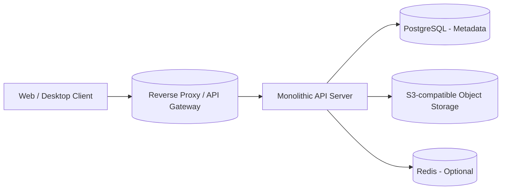

# Personal File Storage Service (Dropbox-like MVP)

## 1. Product Scope

### 1.1 Overall Vision

Build a lightweight, Dropbox-like personal file storage service where a single user can:

- Upload and download files from a web or desktop client.
- Organize files into folders.
- Generate read-only share links with expiration.
- Keep files roughly in sync across multiple devices via a simple "delta" API.

This project is intentionally designed as a **teaching-oriented MVP** implemented as a **single-process monolith**, while still reflecting real-world architectural concerns (storage abstraction, metadata vs. blob separation, eventual consistency, etc.).

---

### 1.2 MVP Scope (This Project)

**Goal:** A runnable monolithic application on a single machine (e.g., your Mac) that exposes HTTP APIs for file storage and basic sharing. The MVP favors **conceptual clarity** and a clean architecture over horizontal scalability.

#### Functional Scope

1. **Authentication (Minimal)**
   - User registration.
   - User login with session or JWT.
   - Single-tenant per user: each user sees only their own files and folders.

2. **File Management**
   - Upload file (single request per file; no chunking in MVP).
   - Download file.
   - List files in a folder.
   - Basic soft delete (mark a file as deleted, hide it from default listing).

3. **Folder / Directory Management**
   - Create folder (with parent folder).
   - List folder contents (files + sub-folders).
   - Soft delete folder (optional for MVP; can be implemented as a simple flag).
   - Flat "move" and "rename" are out of scope for MVP (see V1).

4. **Read-only Share Links**
   - Generate a share link for a single file (not folder) with:
     - Random, unguessable token.
     - Expiration timestamp.
   - Public download endpoint that:
     - Validates token and expiration.
     - Streams the file content if valid.
   - Ability to revoke a share link (by disabling or deleting it).

5. **Basic Sync / Delta API**
   - A "delta" endpoint for clients to fetch changes since a given cursor:
     - Create / update / delete for files and folders.
   - Simple conflict model: **last write wins** for metadata.
   - No real-time push; clients will **poll** the delta endpoint periodically.

#### Non-Functional Scope for MVP

- Single region, single deployment, single database instance.
- Eventual consistency is acceptable across:
  - Multiple devices for the same user.
  - Share link visibility vs. underlying metadata changes.
- No multi-tenancy for organizations / teams.
- No large file chunking or deduplication.
- No server-side full-text search.

---

### 1.3 Out of Scope for MVP

- Team/organization spaces, group-based permissions, or fine-grained ACLs.
- Real-time collaborative editing (e.g., Google Docs style).
- Large file chunking / resumable uploads / content-based deduplication.
- Multi-region replication and global routing.
- Enterprise-grade security/compliance (KMS, customer-managed keys, etc.).
- Full CDN integration (conceptually acknowledged but not implemented).

These may be introduced conceptually in V1/V2 but **are not implemented** in the MVP code.

---

### 1.4 Future V1 / V2 (High-level Only)

These stages are **descriptive only**, to guide future evolution, and are not part of the MVP implementation.

#### V1 (Future)

- Chunked uploads and resumable uploads for large files.
- Simple content-based deduplication (file-level, not block-level).
- Folder move / rename with cascading metadata updates.
- Basic CDN integration for download endpoints.
- Better sync API with pagination and stronger cursor semantics.

#### V2 (Future)

- Real multi-device sync with push notifications (WebSockets / push service).
- Team spaces, groups, and fine-grained permissions.
- Multi-region deployment with cross-region replication.
- Tiered storage and lifecycle policies.
- Optional end-to-end encryption vs. server-managed keys.

---

## 2. System Architecture

### 2.1 High-Level Architecture (MVP, Single-Instance Monolith)

The MVP is a **single process** exposing an HTTP API, backed by:

- A relational database (e.g., PostgreSQL) for metadata.
- An S3-compatible object storage for file content (e.g., MinIO in local dev).
- Optional cache layer (e.g., Redis) for hot metadata and short-lived tokens (can be skipped in the very first implementation).

#### Components

1. **Client (Web / Desktop)** 
    
    - Responsible for:
        
        - Authentication flow (obtain and attach tokens).
            
        - Calling metadata APIs for listing, folder structure, etc.
            
        - Uploading/downloading file content.
            
        - Polling the delta endpoint for sync.
            
2. **Reverse Proxy / API Gateway**
    
    - In MVP, this can be Nginx or the built-in dev server.
        
    - Responsibilities:
        
        - TLS termination (if used).
            
        - Basic routing to the monolithic app.
            
3. **Monolithic API Server**
    
    - Contains:
        
        - Authentication / user management.
            
        - Metadata service (files, folders, share links).
            
        - Delta / sync logic.
            
        - Blob storage abstraction (S3 client).
            
    - Organized internally into logical modules (e.g., `auth`, `metadata`, `sharing`, `sync`, `storage`), but compiled and deployed as one binary/process.
        
4. **Metadata Store (PostgreSQL)**
    
    - System of record for:
        
        - Users.
            
        - Folders.
            
        - Files and their metadata.
            
        - Share links.
            
        - Change log for sync cursors.
            
5. **Blob Storage (S3-compatible)**
    
    - Stores raw file content ("blobs").
        
    - Addressed by a generated `storage_key` (e.g., `user/<user_id>/<uuid>`).
        
    - Local development uses **MinIO** or **LocalStack** to emulate S3.
        
    - Production-ready architecture can transparently switch to real S3 or another object store via configuration.
        
6. **Cache (Optional, e.g., Redis)**
    
    - Can be skipped initially.
        
    - Future use cases:
        
        - Caching folder listings.
            
        - Caching share link token resolution.
            
        - Storing sync cursors and sessions.
            
Note that we are not going to implement **Client (Web / Desktop)** and **Reverse Proxy / API Gateway** in our project.

---

## 3. Data Models

The MVP uses a relational schema. Below is a conceptual model (field names and types can be adjusted to the implementation language/framework).

### 3.1 User

Represents a single end user.

|Field|Type|Notes|
|---|---|---|
|id|UUID / BIGINT|Primary key|
|email|STRING|Unique; used for login|
|password_hash|STRING|Hashed password|
|created_at|TIMESTAMP||
|updated_at|TIMESTAMP||
|deleted_at|TIMESTAMP|Nullable; soft delete|

Authentication uses a standard approach (e.g., JWT or session cookies). Multi-factor auth is out of scope for MVP.

---

### 3.2 Folder

Represents a folder in the user's private namespace.

|Field|Type|Notes|
|---|---|---|
|id|UUID / BIGINT|Primary key|
|user_id|FK(User)|Owner|
|name|STRING|Folder name (no global uniqueness)|
|parent_id|FK(Folder)|Nullable; `NULL` indicates root-level folder|
|created_at|TIMESTAMP||
|updated_at|TIMESTAMP||
|deleted_at|TIMESTAMP|Nullable; soft delete|

### 3.3 File

Represents a single logical file object.

|Field|Type|Notes|
|---|---|---|
|id|UUID / BIGINT|Primary key|
|user_id|FK(User)|Owner|
|folder_id|FK(Folder)|Parent folder|
|name|STRING|File name visible to the user|
|size_bytes|BIGINT|File size in bytes|
|mime_type|STRING|MIME type (best-effort)|
|storage_key|STRING|Key used to locate the file in blob storage|
|checksum|STRING|Optional (e.g., MD5/SHA256) for integrity check|
|version|INT|Simple integer version, starting at 1 (no history in MVP)|
|status|STRING|e.g., `ACTIVE`, `DELETED`, `UPLOAD_IN_PROGRESS`|
|created_at|TIMESTAMP||
|updated_at|TIMESTAMP||
|deleted_at|TIMESTAMP|Nullable; soft delete|

### 3.4 ShareLink

Represents a read-only shareable link for a single file.

|Field|Type|Notes|
|---|---|---|
|id|UUID / BIGINT|Primary key|
|file_id|FK(File)|The file being shared|
|user_id|FK(User)|Owner who created the link|
|token|STRING|Random, unguessable string used in the URL|
|expires_at|TIMESTAMP|Optional; `NULL` means no expiration in MVP|
|max_downloads|INT|Optional; `NULL` means unlimited (can be ignored in MVP)|
|download_count|INT|Counter, for optional limits / stats|
|is_disabled|BOOLEAN|Allows revoking the link without deleting it|
|created_at|TIMESTAMP||
|updated_at|TIMESTAMP||

### 3.5 ChangeLog / Delta

To support the sync/delta API, each significant change is recorded as a log entry.

|Field|Type|Notes|
|---|---|---|
|id|BIGSERIAL|Monotonically increasing primary key; used as cursor|
|user_id|FK(User)|Change belongs to this user's namespace|
|entity_type|STRING|e.g., `FILE` or `FOLDER`|
|entity_id|UUID / BIGINT|ID of the file/folder|
|op|STRING|`CREATE`, `UPDATE`, `DELETE`|
|snapshot|JSONB|Lightweight snapshot or partial state for the entity|
|created_at|TIMESTAMP||

---

## 4. Non-Functional Requirements

Even though this is an MVP running on a single machine, we still define NFRs to guide implementation decisions and prepare for future evolution.

### 4.1 Performance Targets

Targets are **design goals**, not strict SLAs, for a typical dev/hobby deployment.

1. **Metadata APIs**
    
    - List folder contents (≤ 1,000 items):
        
        - Latency: `p95 < 300 ms`
            
    - Create folder, create file metadata, generate share link:
        
        - Latency: `p95 < 300 ms`
            
2. **File Upload & Download**
    
    - Small files (≤ 10 MB):
        
        - Upload end-to-end: `p95 < 3 s` over a normal home network.
            
        - Download end-to-end: `p95 < 2 s`.
            
    - Large file performance tuning is out of scope; MVP only needs to behave reasonably.
        
3. **Sync / Delta**
    
    - `GET /delta` for a typical user (≤ 1,000 recent changes):
        
        - Latency: `p95 < 300 ms`.
            

---

### 4.2 Availability & Reliability

For a single-instance MVP:

- **Uptime**
    
    - No formal SLO; availability is "best effort".
        
    - The architecture should be easily deployable as a single binary + DB + object store.
        
- **Durability**
    
    - **No data loss** is expected from application logic:
        
        - Soft delete is used instead of hard delete in MVP.
            
        - Hard delete (if added) should require explicit flows.
            
    - Durability of file content relies on the underlying blob store:
        
        - In local dev, MinIO is single-node (no real redundancy).
            
        - In production, we would assume cloud object storage with multiple replicas.
            

---

### 4.3 Consistency

The system is explicitly **eventually consistent**:

- Multiple devices see changes with a delay governed by:
    
    - Client polling interval for the delta API.
        
    - Propagation of change log entries in the DB.
        
- Within a single request:
    
    - There is no multi-operation distributed transaction across metadata and blob storage.
        
    - Instead, operations must:
        
        - Be **idempotent** (e.g., using file IDs and status flags).
            
        - Use compensating logic where applicable (e.g., cleaning up orphan blobs, orphans metadata).
            
- Conflict handling:
    
    - Last writer wins based on server timestamps.
        
    - Complex user-facing conflict resolution UI is explicitly out of scope.
        

---

### 4.4 Security

Security for the MVP focuses on the basics:

1. **Authentication**
    
    - Password-based login with proper hashing (e.g., bcrypt/argon2).
        
    - Tokens (e.g., JWT) signed with a secret key and short-lived.
        
2. **Authorization**
    
    - All metadata APIs filter by `user_id`.
        
    - Share link APIs only allow the owner to create/disable links for their own files.
        
    - Public shared endpoint only has access via token; no other user data is leaked.
        
3. **Transport Security**
    
    - For local dev, HTTP is acceptable.
        
    - For any real deployment, HTTPS is required (via reverse proxy).
        
4. **Data Protection**
    
    - Blob content may be encrypted at rest by the underlying storage (e.g., S3 SSE).
        
    - Application-level encryption and end-to-end encryption are out of scope for MVP.
        

---

### 4.5 Scalability & Evolvability

While the MVP runs as a monolith, the architecture should:

- Clearly separate concerns:
    
    - Auth vs. metadata vs. sharing vs. sync vs. blob storage.
        
- Make it straightforward to:
    
    - Extract a dedicated metadata service.
        
    - Move to a managed object store (S3, GCS).
        
    - Introduce caches and background workers for heavier workloads.
        

No horizontal scaling or sharding is required for the MVP, but:

- Primary keys should be globally unique (UUIDs / bigints).
    
- No assumptions should lock the system into a single-node-only future (e.g., avoid relying on local filesystem as the only blob store).